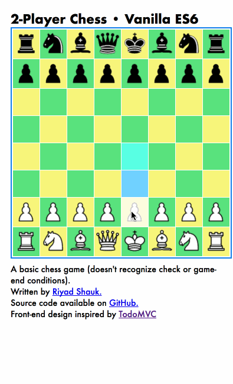

# chess
Though I made this game for fun, I was able to include [an online demo here](http://web.engr.illinois.edu/~shauk2/), from my alma mater (working, as of this commit, at least : )  

This is a chess game written in plain/vanilla-flavored ES6 JavaScript, HTML 5, CSS, and bundled with the Google Closure Compiler. It's modeled after [the vanilla ES6 TodoMVC example](http://todomvc.com/examples/vanilla-es6/).
  

###Local Setup:
```shell
$ git clone https://github.com/riyadshauk/chess
$ cd chess/front_end/
$ npm install
$ npm run compile
$ open public/index.html # (open is a macos command, opens file in default browser)
```

######**Note:** The game source files are already bundled into one javascript file, so it works locally without needing to install anything. Just open chess/front_end/public/index.html in a browser to play.  ######

###Todo: Codebase###
- [ ] heavily refactor codebase (make more modular, less coupled)
- [ ] revisit the decision to use Google Closure Compiler, refactor
- [ ] make tests forward-compatible with ES6 and look into testing libraries

###Todo: Chess Gameplay Features###
- [ ] add game-end condition recognition
- [ ] add undo/redo functionality (consider use of FEN, PGN, SAN)
- [ ] add ability to load/save game
- [ ] game timer
- [ ] be able to play against computer/AI

###Todo: General Project Features###
- [ ] users & client/server
- [ ] chat
- [ ] ML?
- [ ] live extensibility